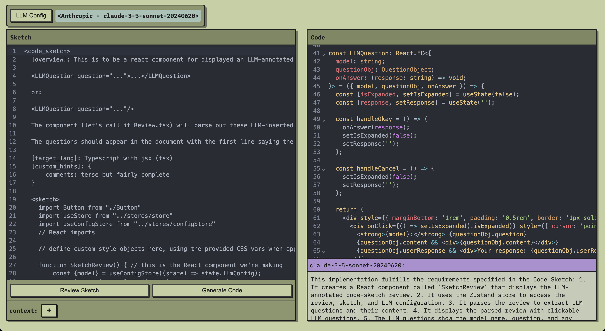

# code-sketch


 
This is a prototype app for working with LLMs to refine "code sketches" and translate them into fully fleshed out code.

To run (after cloning):

Set up your API keys by creating a .env file at `code-sketch/packages/server/.env` with:
```
ANTHROPIC_API_KEY: <your_anthropic_key>
OPENAI_API_KEY: <your—openai_key>
```
If you don't want to use either of those providers, it can also use your local Ollama install (select within app). That said, in my experience only Sonnet 3.5 and Opus 3 are good enough at following instructions to fully comply with the prompts at the core of the application. It's still usable otherwise, but definitely at a lower quality level.

Then (from repo root):
```
npm install
npm run
```

The project uses NPM workspaces to create a monorepo for 3 packages: client, server, and shared-types. It's written primarily in Typescript with a Node/Express backend and a React frontend (built with Vite), and works with OpenAI, Anthropic, or local LLMs (via Ollama).

# Usage guidelines
Click "LLM Config" to select the LLM you'd like to work with.

_Check out the example sketches in `sketch examples` if you're not sure what to put in your sketch—it's pretty open-ended though!_

Write or paste in a "code sketch" following the format of the example sketch the app loads with; if you need to add additional contextual information for the LLM click the "+" button at the bottom and paste it in. Then click either "Review Sketch" or "Generate Code"; if you go for the review the LLM will check for ambiguities, inconsistencies etc in what you've described in your sketch and insert a number of follow up questions. From there you can have the LLM refine the sketch from your answers (or just take the questions into consideration and manually update your sketch—probably safest). If you feel your sketch is good to go, hit Generate Code—that's it.

# Motivation

If there are two things LLMs are super good at it's "working out the details" and translation; generating code from sketches like this moves the problem squarely into that domain. And on the programmer's side, if you're building something with a very intentional design behind it, at some point it becomes more efficient to sketch the outlines of/constraints on what you'd like rather than imperatively instructing the LLM.

This is an attempt to approach an ideal: what's the minimum information I can give, that's most efficieintly expressible by me, which is also sufficient for an LLM to generate a block of code that precisely matches my intentions/requirements.

It's often the case that the requirements for a piece of code you're attempting to generate (via LLM) are mostly implied by the constraints and interaction requirements of the various pieces of technologies involved—'plumbing' in other words. In these cases, fairly little original input is required from the developer. The 'spec-driven' mode of LLM software development is for cases on the opposite end of that spectrum: where the code expresses some body of original ideas, likely still evolving in the mind of the user.

For these cases of thought-intensive, highly intentionally designed—often foundational in some sense—code structures, LLMs need more guidance. The construction of code sketch 'specs' serves a dual purpose in these cases: 1. they can help the thinker/programmer to work out critical high-level details they may not have yet considered in the more abstract headspaces they've spending time in; the process of writing such a sketch is often all it takes to draw these out. 2. the resulting sketch is of near ideal form for an LLM to show its prowess at code generation (because it's working in its favorite domains of translation and detail-working out).
